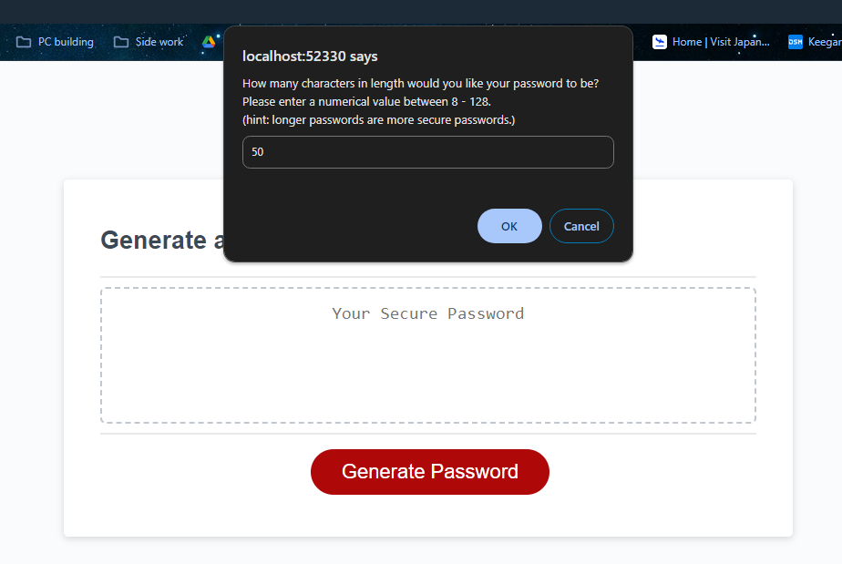
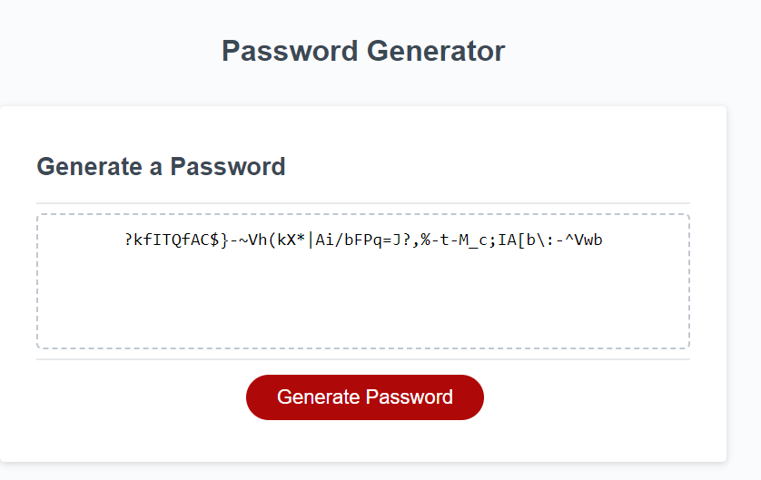

# Password Generator

## Description

A password generator that can generate a random password based on user criteria and input.

## Table of Contents

- [Introduction](#introduction)
- [Problem](#problem)
- [Solution](#solution)

## Introduction

The client has access to sensitive data and would like to be able to randomly generate passwords that meets desired criteria. The client desires strong passwords for greater security.

## Problem

The graphics for the aplication to generate a random password are in place but the generator does not work to generate a password of any kind.

## Solution

I created the javascript necessary to generate a password based on user selected criteria. The options for the password include:

    Upper case letters
    Lower case letters
    Numbers
    Special Characters
    Not less than 8 characters and no more than 128 characters

The client is prompted to choose whether they would like each of the options and a random password is created based upon their selections. If the client declines to use an option, they are allowed to move forward but are encouraged to choose options that will help their password be more secure.

[Link to the deployed application](https://ktetsuyama.github.io/Password_generator/)

## Credits

I collaborated George Schultz, Aster Oliva, Meera G K, and Aileen Ngyuen to troubleshoot any bugs that I had during development of this application. I also used phind.com to understand why my variables weren't being called. 

Tutorials used:

[Stackoverflow post about allowing the user to quit a javascript window](https://stackoverflow.com/questions/12864582/javascript-prompt-cancel-button-to-terminate-the-function)

## License

MIT License
